## 项目结构
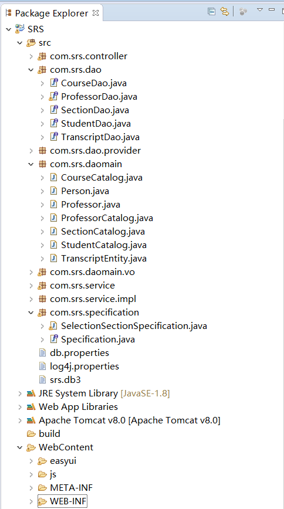
## 数据库结构
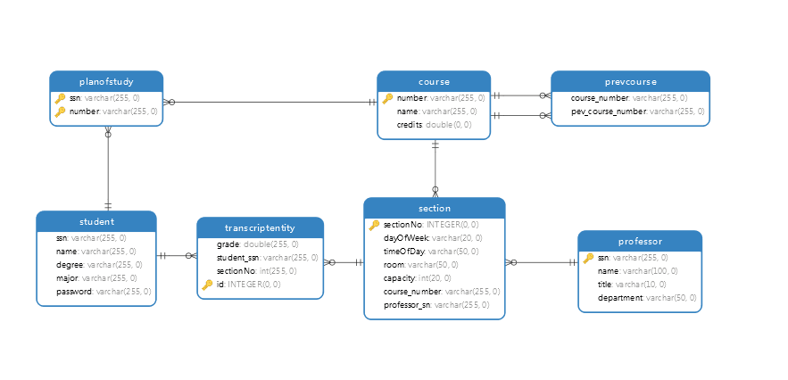
## 选课时序图
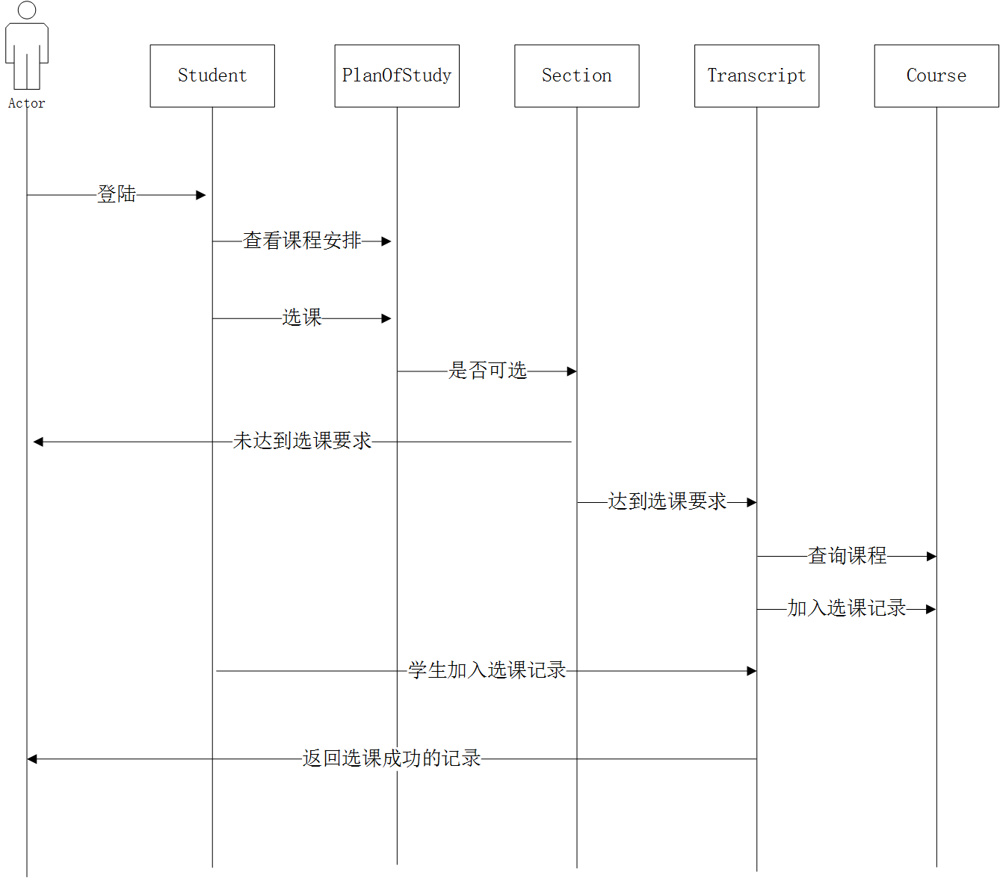
## 查询成绩时序图
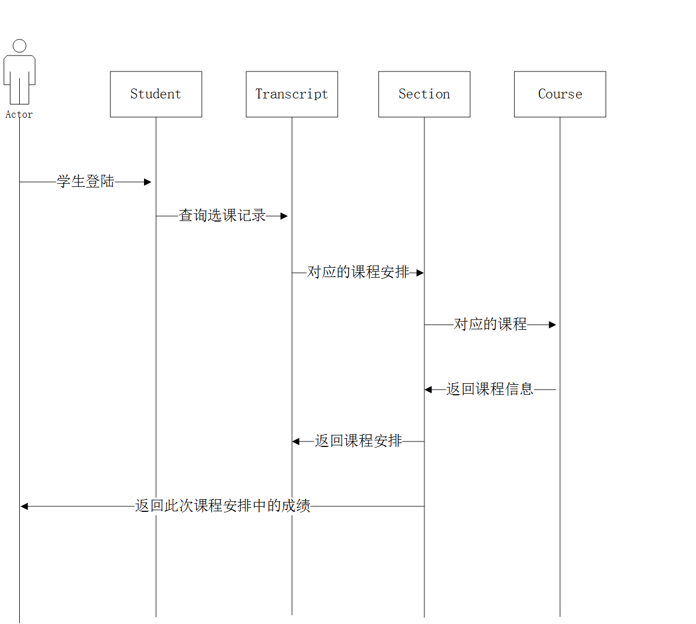

## 选课逻辑代码
	public String validate(Student student, Section section) {	
		String result=null;
		boolean inPlan=false;//培养计划是否包含这门课程
		boolean selected=false;//是否已选该门课程	
		if(section.getCapacity()<=section.getEnrolledStudents().size()){
			result="人数已满！";
		}else{
			//判断培养计划是否包含这门课程
			if(student.getPlanOfStudy().contains(section.getCourse())){
				inPlan=true;
			}else{
				result="您的课程计划中不包含这门课程！";
			}
			//当培养计划包含这门课时进行是否选过这门课判断
			if(inPlan==true){
				if(student.getAttends() != null){
					//判断学生是否已经选过此课
					if(student.getAttends().contains(section.getCourse())){
						selected=true;
						result="您已经选过这门课程!";
					}
				}
			}
			//判断先修课程是否选过并及格判断
			if(inPlan==true && selected==false){
				if(section.getCourse().getPrevCourse() != null){
					//课程的先修课程列表
					List<Course> preList = section.getCourse().getPrevCourse();
					if(student.getTranscript()!=null){
						//如果先修课程满足
						if(student.getTranscript().containsAll(preList)){
							result = "选课成功";
						}else{
							result="先修课程不达标！";
						}
					}
				}
			}
		}
		return result;
	}

##
## 运行界面
### (1)登陆页面
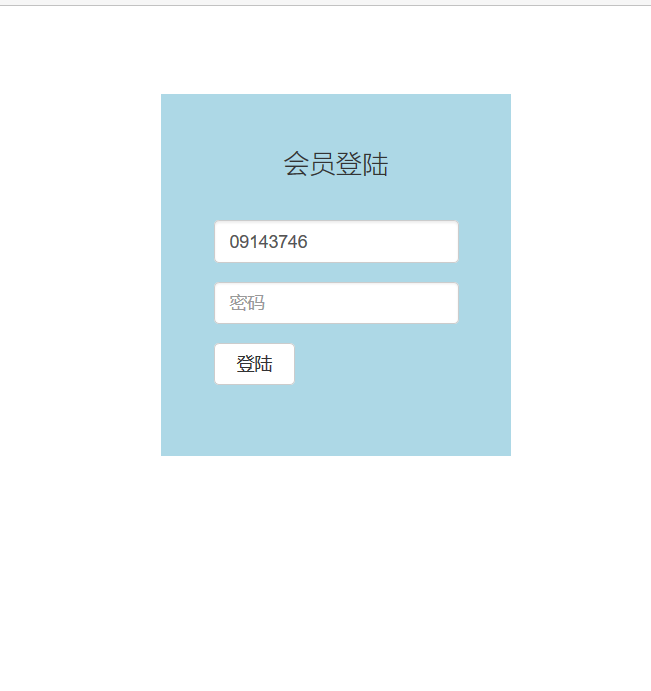;
### (2)选课首页
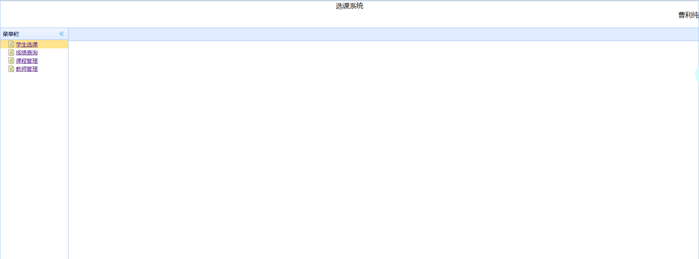
### (3)学生选课
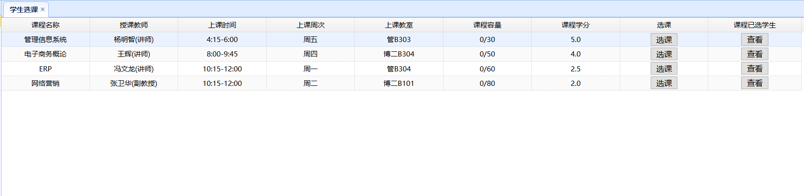
### (4)选课时课程不在该选课计划内
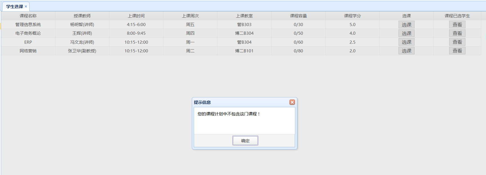
### (5)选课时先修课程不达标
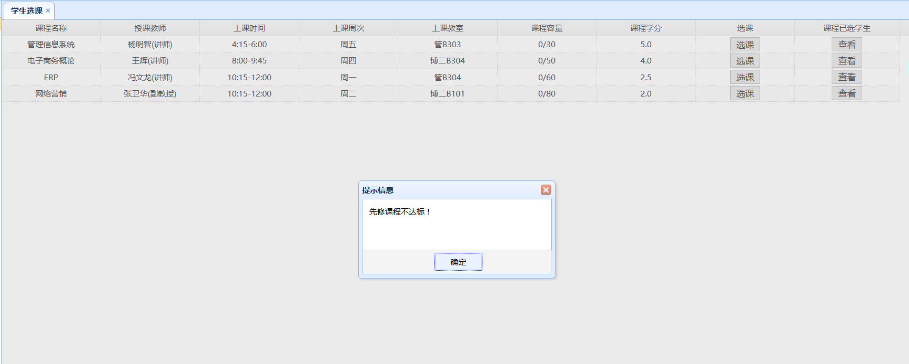
### (6)选课成功
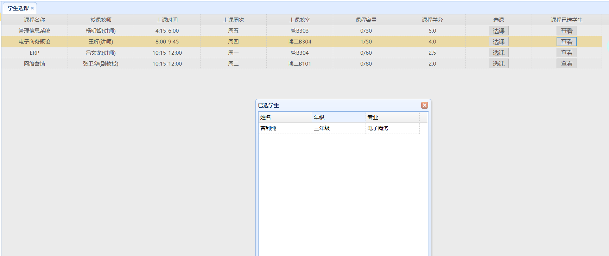
### (7)添加课程

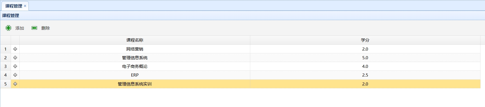
### (8)删除课程

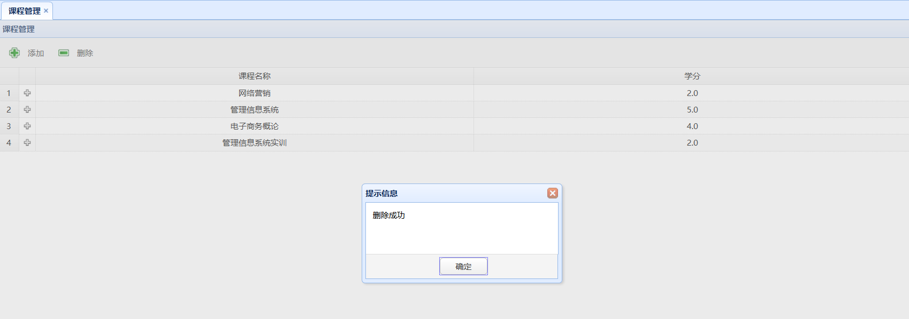
### (9)查询成绩
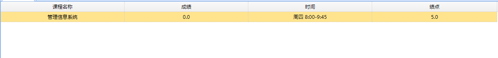
### (10)课程管理
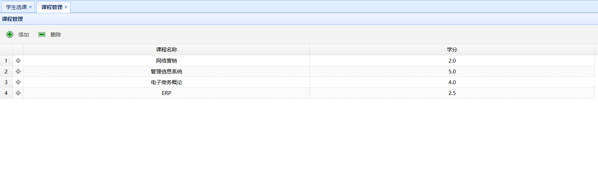
### (11）教师管理
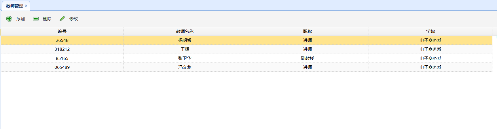
